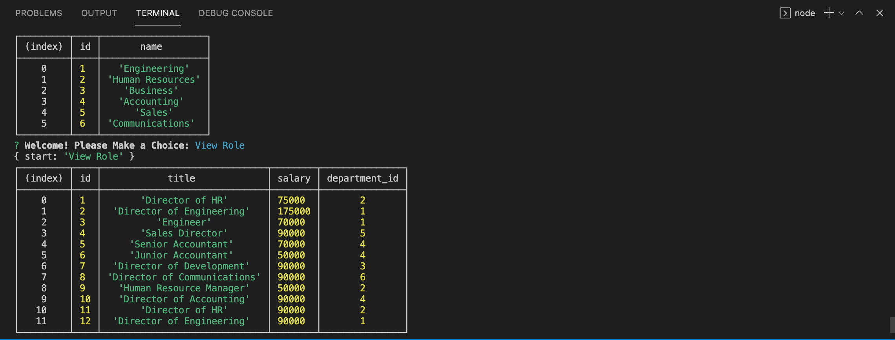

# Employee-Tracker

## Table of Contents
### Description
### Images
### Deployed Application

## Description
This project focuses on creating an application that can be used by business owners to be able to veiw and maange the departments, roles and employees in the company, which can organize and plan the business. Specifically through the command-line application, the user will be able to follow an assortment of options listed to choose from. When prompted to view all departments, roles, or employees, the user will be presented with the table of the current status of each table. This application will be able to add departments, roles, and employees, as well as updating the employee role. When the application changes are completed, the updated tables can be seen when in 'View' mode.

## Images
Below is an image of the Employee Tracker application deployed Department and Role Tables:

## Deployed Application
Below is a link to a walkthrough video of the deployed application:
<a href="https://notetakerapp-01.herokuapp.com/">Create Your Note!</a> 